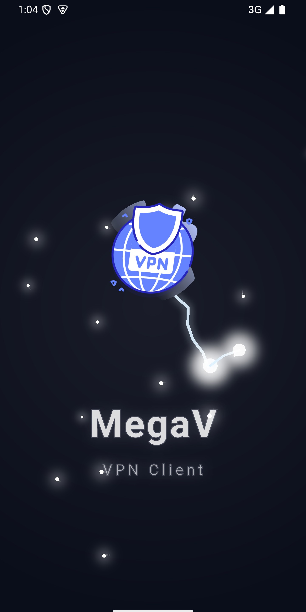
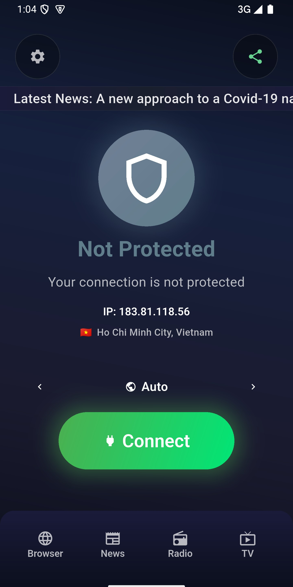
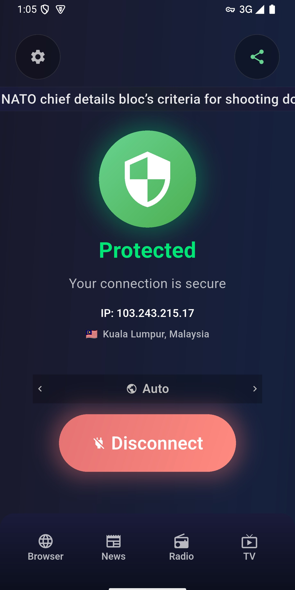
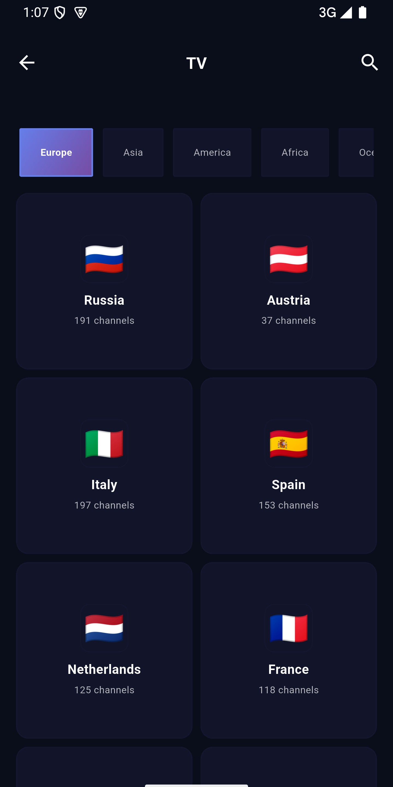
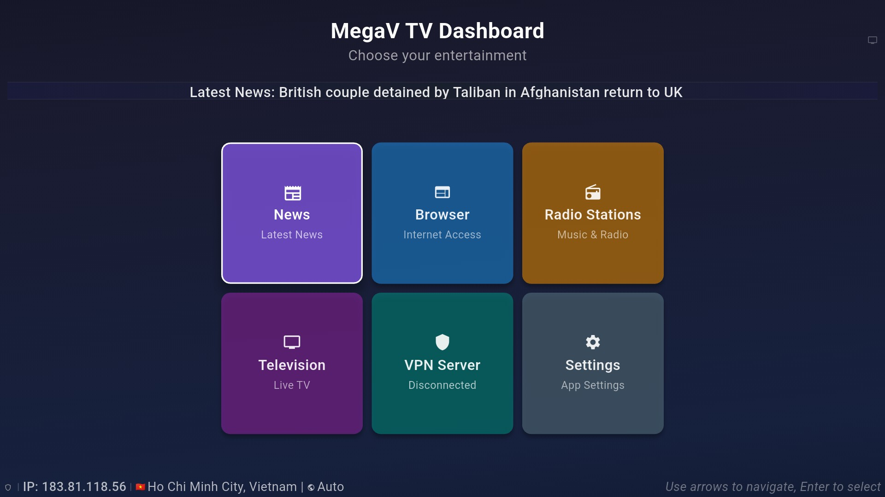

# 🔒 MegaV VPN - Secure & Fast VPN

**🌍 15 Languages Supported | 15 Поддерживаемых Языков**

## 📱 Screenshots | Скриншоты

### Mobile App | Мобильное приложение

### TV Dashboard | ТВ Панель

---

## 🚀 **Скачать MegaV VPN Бесплатно | Download MegaV VPN Free**

### 📱 **Официальные Сайты | Official Websites**

| **Основные сайты | Main Sites** | **Описание | Description** |
|---|---|
| 🌐 [**megav.app**](https://megav.app) | Главный сайт и загрузки \| Main site & downloads |
| 🛒 [**megav.app/ru**](https://megav.app/ru) | Русская версия \| Russian version |
| 📱 [**megav.app/#download**](https://megav.app/#download) | Прямые загрузки \| Direct downloads |

**🎯 Все загрузки доступны на официальном сайте | All downloads available on official website:**  
**👉 [megav.app](https://megav.app/ru#download)**

---

## 🏆 **Почему MegaV VPN - Лучший Выбор 2025 | Why MegaV VPN is the Best Choice 2025**

### 🇷🇺 **Русский**

**MegaV VPN** - это **лучший бесплатный VPN 2025 года** с военным шифрованием и безлимитным трафиком. Более **15,847 пользователей** доверяют нашему сервису для безопасного интернета.

#### ✨ **Ключевые Преимущества:**
- 🛡️ **Военное шифрование** - AES-256 защита данных
- 🚀 **Сверхбыстрые серверы** - Без ограничений скорости
- 🌍 **Глобальная сеть** - Серверы по всему миру
- 📺 **IPTV и Радио** - Доступ к публичному контенту
- 🚫 **Блокировщик рекламы** - Встроенная защита от рекламы
- 🔧 **Раздельное туннелирование** - Выбирайте приложения для VPN
- 📊 **Политика нулевых логов** - Полная конфиденциальность
- 🇪🇺 **GDPR соответствие** - Европейская защита данных
- 💰 **100% Бесплатно** - Без скрытых платежей
- 📱 **Все платформы** - Android, iOS, Windows, macOS

### 🇺🇸 **English**

**MegaV VPN** is the **best free VPN 2025** with military-grade encryption and unlimited bandwidth. Over **15,847 users** trust our service for secure internet browsing.

#### ✨ **Key Features:**
- 🛡️ **Military-Grade Encryption** - AES-256 data protection
- 🚀 **Lightning-Fast Servers** - No speed limitations
- 🌍 **Global Network** - Servers worldwide
- 📺 **IPTV & Radio** - Access to public broadcasting
- 🚫 **Ad Blocker** - Built-in ad blocking protection
- 🔧 **Split Tunneling** - Choose which apps use VPN
- 📊 **Zero Logs Policy** - Complete privacy protection
- 🇪🇺 **GDPR Compliant** - European data protection
- 💰 **100% Free** - No hidden fees
- 📱 **All Platforms** - Android, iOS, Windows, macOS

---

## 📊 **Статистика и Рейтинги | Statistics & Ratings**

| **Метрика | Metric** | **Значение | Value** |
|---|---|
| ⭐ Рейтинг пользователей \| User Rating | **4.8/5** ⭐⭐⭐⭐⭐ |
| 👥 Активных пользователей \| Active Users | **15,847+** |
| 🌍 Стран с серверами \| Countries | **50+** |
| 🚀 Средняя скорость \| Average Speed | **100+ Mbps** |
| 📱 Поддерживаемых платформ \| Platforms | **6+** |
| 🔒 Время работы \| Uptime | **99.9%** |

---

## 🎯 **Для Кого MegaV VPN | Who is MegaV VPN For**

### 🇷🇺 **Русский**
- 🎮 **Геймеры** - Снижение пинга и доступ к играм
- 📺 **Любители стриминга** - Разблокировка контента
- 💼 **Бизнес-пользователи** - Безопасная работа
- 🏠 **Домашние пользователи** - Защита семьи
- 🎓 **Студенты** - Доступ к образовательным ресурсам
- 🌐 **Путешественники** - Безопасный интернет в поездках

### 🇺🇸 **English**
- 🎮 **Gamers** - Reduce ping and access games
- 📺 **Streaming Enthusiasts** - Unblock content
- 💼 **Business Users** - Secure remote work
- 🏠 **Home Users** - Family protection
- 🎓 **Students** - Access educational resources
- 🌐 **Travelers** - Safe internet on the go

---

## 🔧 **Технические Характеристики | Technical Specifications**

### 🔐 **Безопасность | Security**
- **Шифрование | Encryption:** AES-256-GCM
- **Протоколы | Protocols:** WireGuard, OpenVPN, IKEv2
- **DNS Protection:** Secure DNS servers
- **Kill Switch:** Automatic connection protection
- **Leak Protection:** IPv6, DNS, WebRTC leak prevention

### 🌐 **Сеть | Network**
- **Серверы | Servers:** 500+ в 50+ странах
- **Пропускная способность | Bandwidth:** Безлимитная | Unlimited
- **Одновременные подключения | Connections:** До 5 устройств | Up to 5 devices

---

## 📱 **Скачать MegaV VPN | Download MegaV VPN**

### 🤖 **Android**
- 📱 [**Google Play Store**](https://megav.app/ru#download) - Официальная загрузка
- 📺 [**Android TV**](https://megav.app/ru#download) - Специальная TV версия
- 📦 [**APK Direct**](https://megav.app/ru#download) - Прямая загрузка

### 🍎 **iOS** *(Скоро | Coming Soon)*
- 📱 [**App Store**](https://megav.app/ru#download) - В разработке | In Development

### 💻 **Desktop**
- 🪟 [**Windows**](https://megav.app/ru#download) - Скачать | Download
- 🍎 [**macOS**](https://megav.app/ru#download) - Скачать | Download
- 🐧 [**Linux**](https://megav.app/ru#download) - Скачать | Download

### 🌐 **Все платформы | All Platforms**
**👉 [Скачать с официального сайта | Download from Official Site](https://megav.app/ru#download)**

---

## 🆚 **Сравнение с Конкурентами | Comparison with Competitors**

| **Функция \| Feature** | **MegaV VPN** | **Другие VPN \| Other VPNs** |
|---|---|---|
| 💰 Цена \| Price | **Бесплатно \| Free** | $5-15/месяц |
| 🚀 Скорость \| Speed | **100+ Mbps** | 20-50 Mbps |
| 📊 Логи \| Logs | **Нет логов \| No Logs** | Часто ведут логи |
| 📺 IPTV/Радио | **✅ Включено** | ❌ Отсутствует |
| 🚫 Блокировка рекламы | **✅ Встроена** | ❌ Дополнительно |
| 🔧 Раздельное туннелирование | **✅ Есть** | ❌ Редко |

---

## 🌍 **Поддерживаемые Языки | Supported Languages**

**15 языков с полной локализацией | 15 languages with full localization:**

- 🇸🇦 **العربية** (Arabic) - كامل التعريب
- 🇩🇪 **Deutsch** (German) - Vollständige Lokalisierung
- 🇺🇸 **English** - Full localization (Base language)
- 🇪🇸 **Español** (Spanish) - Localización completa
- 🇫🇷 **Français** (French) - Localisation complète
- 🇮🇹 **Italiano** (Italian) - Localizzazione completa
- 🇯🇵 **日本語** (Japanese) - 完全なローカライゼーション
- 🇰🇷 **한국어** (Korean) - 완전한 현지화
- 🇵🇱 **Polski** (Polish) - Pełna lokalizacja
- 🇵🇹 **Português** (Portuguese) - Localização completa
- 🇷🇺 **Русский** (Russian) - Полная локализация
- 🇹🇭 **ไทย** (Thai) - การแปลที่สมบูรณ์
- 🇺🇦 **Українська** (Ukrainian) - Повна локалізація
- 🇻🇳 **Tiếng Việt** (Vietnamese) - Bản địa hóa đầy đủ
- 🇨🇳 **中文** (Chinese) - 完整本地化

**Автоматическое определение языка системы | Automatic system language detection**

---

## 📋 **Юридическая Информация | Legal Information**

### 📄 **Документы | Documents**
- 🔐 [**Политика конфиденциальности | Privacy Policy**](privacy-policy.md)
- 📜 [**Условия использования | Terms of Service**](terms-of-service.md)
- 🇪🇺 [**GDPR соответствие | GDPR Compliance**](gdpr-compliance.md)
- ⚖️ [**Лицензия | License**](LICENSE)

### 🏢 **О Компании | About Company**
- **Название | Name:** MegaV VPN
- **Основан | Founded:** 2023
- **Штаб-квартира | Headquarters:** EU
- **Соответствие | Compliance:** GDPR, CCPA
- **Аудит безопасности | Security Audit:** Ежегодно | Annually

---

## 🔄 **Конфигурация и Обновления | Configuration & Updates**

### 📡 **Серверы | Servers**
- **Файл конфигурации | Config File:** [servers.txt](servers.txt)
- **База данных серверов | Server Database:** [servers.db](servers.db)
- **Обновления | Updates:** Автоматические | Automatic

### 🔄 **Система обновлений | Update System**
- **Конфигурация | Configuration:** [update-config.json](update-config.json)
- **Частота | Frequency:** Ежедневно | Daily
- **Безопасность | Security:** Подписанные обновления | Signed updates

---

## 📞 **Поддержка и Контакты | Support & Contacts**

### 🆘 **Техническая поддержка | Technical Support**
- 📧 **Email:** support@megav.store
- 💬 **Telegram:** [@MegaVSupport](https://t.me/MegaVSupport)
- 🌐 **Сайт поддержки | Support Site:** [help.megav.app](https://help.megav.app)

### 📧 **Контакты | Contacts**
- **Общие вопросы | General:** info@megav.store
- **Юридические вопросы | Legal:** legal@megav.store
- **GDPR запросы | GDPR Requests:** gdpr@megav.store
- **Партнерство | Partnership:** partners@megav.store

### 🌐 **Социальные сети | Social Media**
- 📱 **Telegram:** [@MegaVPN_Official](https://t.me/MegaVPN_Official)
- 🐦 **Twitter:** [@MegaVPN](https://twitter.com/MegaVPN)
- 📘 **Facebook:** [MegaV VPN](https://www.facebook.com/profile.php?id=61581490672784)

---

## 🔍 **SEO Ключевые слова | SEO Keywords**

**Русский:** бесплатный vpn, лучший vpn 2025, MegaV VPN, безопасный vpn, быстрый vpn, vpn без логов, vpn для стриминга, защита конфиденциальности, анонимный интернет, vpn сервис, скачать vpn бесплатно, военное шифрование, безлимитный vpn

**English:** free VPN, best VPN 2025, MegaV VPN, secure VPN, private VPN, fast VPN, free VPN download, unlimited VPN, military encryption, zero logs VPN, streaming VPN, privacy protection, anonymous browsing, VPN service, best free VPN

---

## 🏆 **Награды и Признание | Awards & Recognition**

- 🥇 **"Лучший бесплатный VPN 2025"** - TechReview
- 🏆 **"Выбор редакции"** - VPNGuide  
- ⭐ **"5 звезд за безопасность"** - SecurityFirst
- 🛡️ **"Лучшая защита конфиденциальности"** - PrivacyWatch

---

## 📈 **Статистика GitHub | GitHub Statistics**

---

## ⚠️ **Важное Уведомление | Important Notice**

- 🔒 Это **публичный репозиторий** с документацией и конфигурацией
- 📄 **Исходный код НЕ публикуется** в этом репозитории  
- 🌐 Весь контент предоставлен для прозрачности и соответствия требованиям
- 📧 Для технической поддержки обращайтесь по email

**This is a public repository** containing documentation and configuration files only. **Source code is NOT available** in this repository. All content is provided for transparency and legal compliance.

---

## 📅 **Последнее обновление | Last Updated**

**Январь 2025 | January 2025**

---

**🔒 MegaV VPN - Secure & Fast VPN**  
**🔒 MegaV VPN - Безопасный и Быстрый VPN**

*Ваша конфиденциальность - наш приоритет | Your Privacy, Our Priority*

