# 🔒 MegaV VPN - Secure & Fast VPN

**🌍 Available in 15 Languages**

**[🇷🇺 Русская версия / Russian Version](README_RU.md)**

---

## 📱 Screenshots

### iPhone App
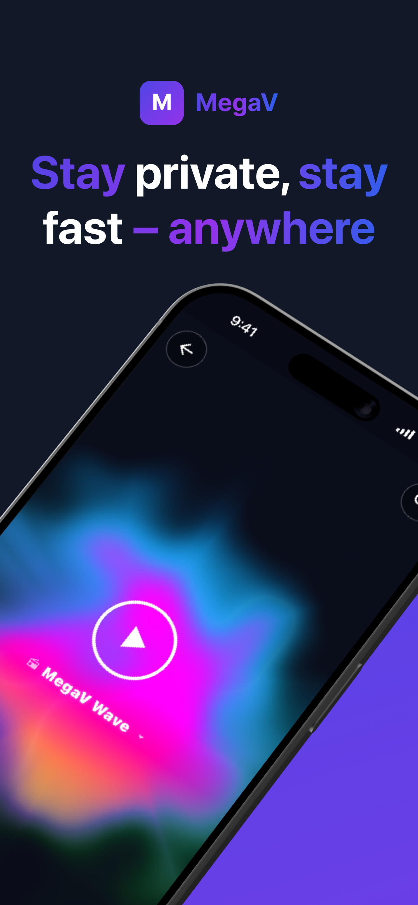
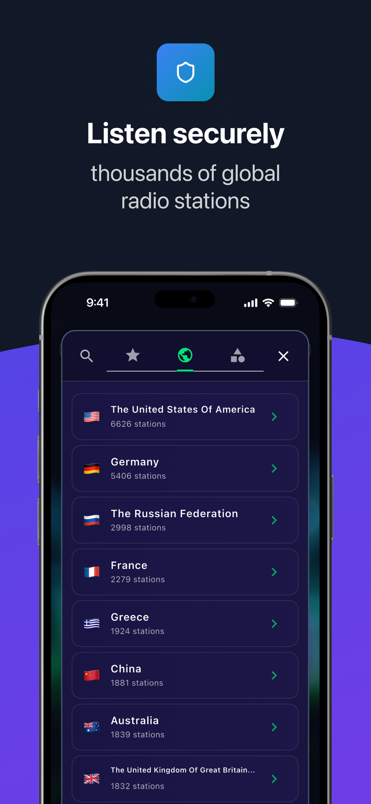
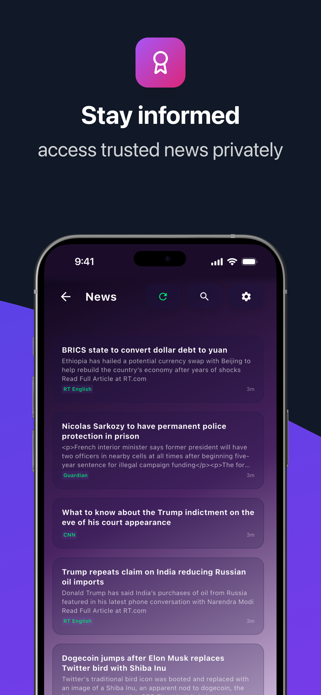
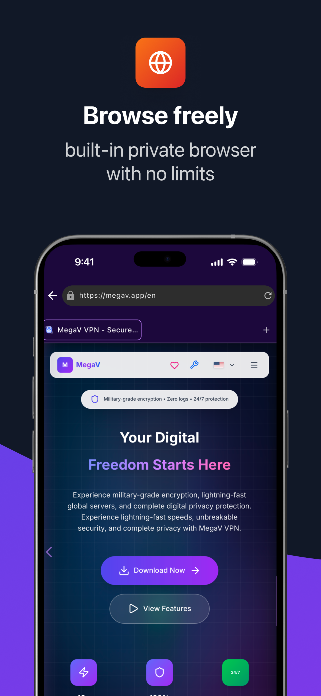
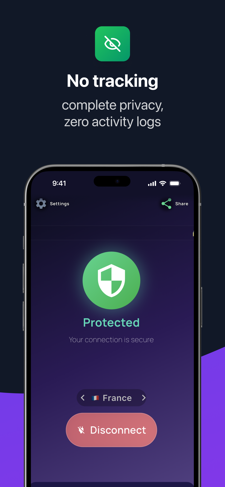
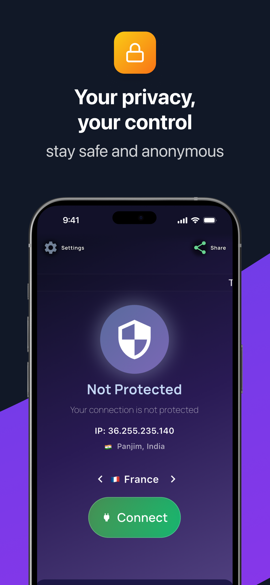

### iPad App
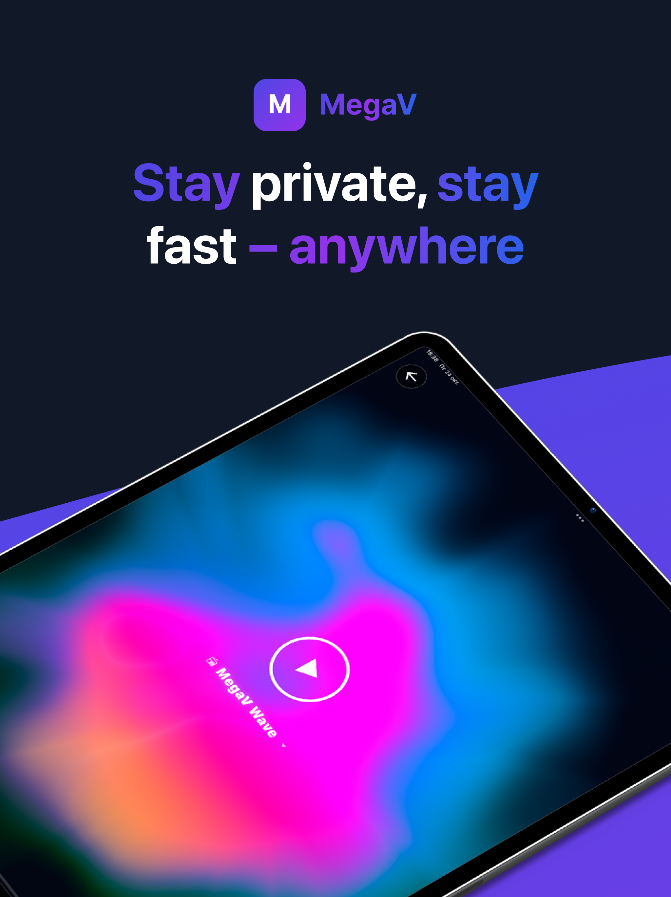
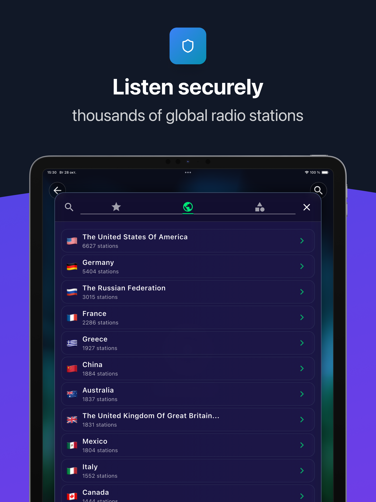
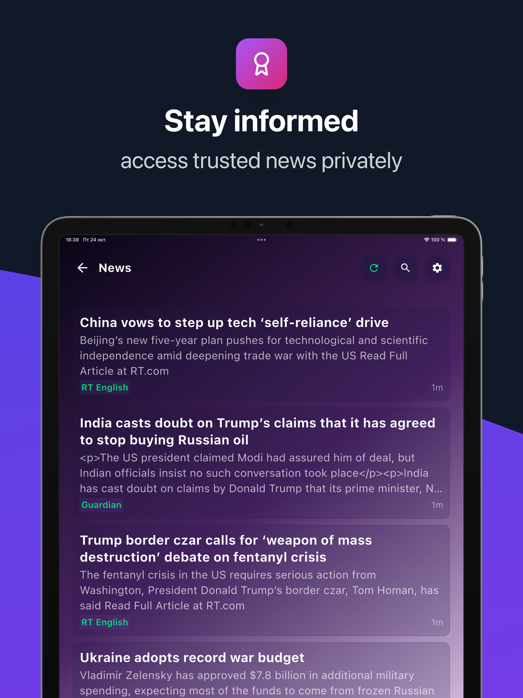
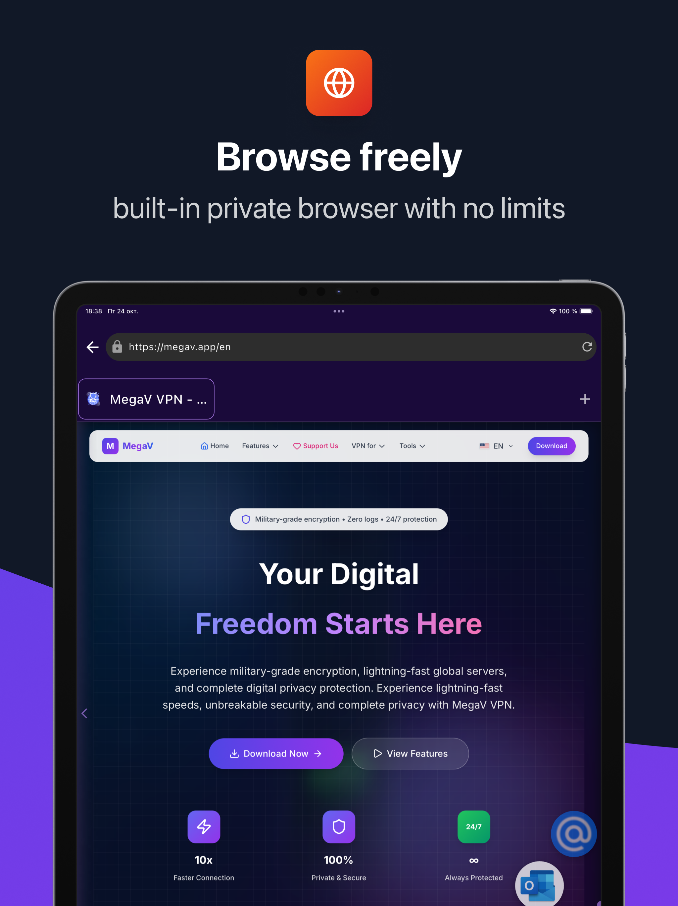
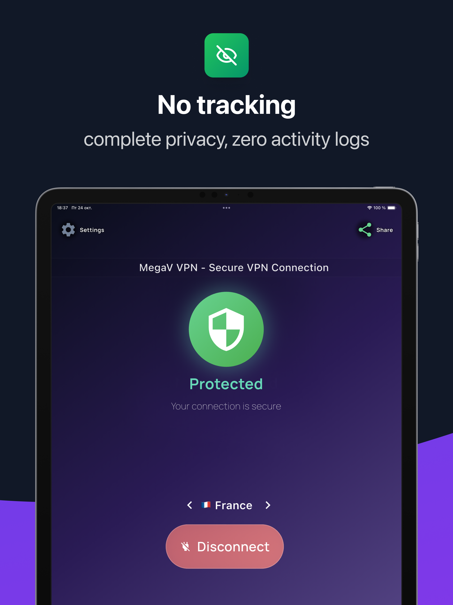
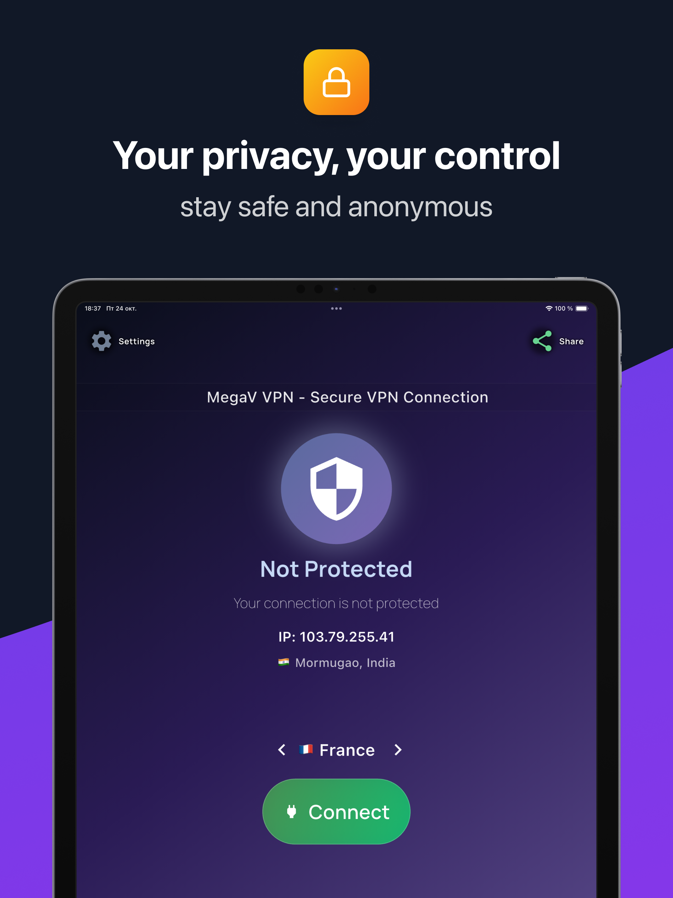

---

## 🚀 Download MegaV VPN

### 🌐 Official Websites

All our domains lead to the same secure service:

| Domain | Status |
|---|---|
| 🌐 [**megav.app**](https://megav.app) | ✅ Main Site |
| 🌐 [**megav.store**](https://megav.store) | ✅ Active |
| 🌐 [**megav-vpn.com**](https://megav-vpn.com) | ✅ Active |
| 🌐 [**megav-vpn.app**](https://megav-vpn.app) | ✅ Active |
| 🌐 [**megav.online**](https://megav.online) | ✅ Active |
| 🌐 [**megav-vpn.online**](https://megav-vpn.online) | ✅ Active |
| 🌐 [**megav-vpn.site**](https://megav-vpn.site) | ✅ Active |
| 🌐 [**megav.site**](https://megav.site) | ✅ Active |
| 🌐 [**megav-vpn.top**](https://megav-vpn.top) | ✅ Active |
| 🌐 [**megav.top**](https://megav.top) | ✅ Active |
| 🌐 [**megav.website**](https://megav.website) | ✅ Active |

**[📱 Download Now](https://megav.app/#download)**

### Platforms
- 🤖 **Android** - Google Play Store, APK Direct
- 🍎 **iOS** - Coming Soon
- 📺 **Android TV** - Special TV version
- 💻 **Windows, macOS, Linux** - Desktop versions

---

## ✨ Key Features

- 🛡️ **Military-Grade Encryption** - AES-256 data protection
- 🚀 **Lightning-Fast Servers** - No speed limitations
- 🌍 **Global Network** - 500+ servers in 50+ countries
- 📺 **IPTV & Radio** - Access to public broadcasting
- 🚫 **Ad Blocker** - Built-in ad blocking protection
- 🔧 **Split Tunneling** - Choose which apps use VPN
- 📊 **Zero Logs Policy** - Complete privacy protection
- 🇪🇺 **GDPR Compliant** - European data protection
- 💰 **100% Free** - No hidden fees
- 📱 **All Platforms** - Android, iOS, Windows, macOS, Linux

---

## 📊 Statistics

| Metric | Value |
|---|---|
| ⭐ User Rating | **4.8/5** ⭐⭐⭐⭐⭐ |
| 👥 Active Users | **15,847+** |
| 🌍 Countries | **50+** |
| 🚀 Average Speed | **100+ Mbps** |
| 🔒 Uptime | **99.9%** |

---

## 🔧 Technical Specifications

### Security
- **Encryption:** AES-256-GCM
- **Protocols:** WireGuard, OpenVPN, IKEv2
- **DNS Protection:** Secure DNS servers
- **Kill Switch:** Automatic connection protection
- **Leak Protection:** IPv6, DNS, WebRTC leak prevention

### Network
- **Servers:** 500+ in 50+ countries
- **Bandwidth:** Unlimited
- **Simultaneous Connections:** Up to 5 devices

---

## 🌍 Supported Languages

**15 languages with full localization:**

🇸🇦 Arabic | 🇩🇪 German | 🇺🇸 English | 🇪🇸 Spanish | 🇫🇷 French | 🇮🇹 Italian | 🇯🇵 Japanese | 🇰🇷 Korean | 🇵🇱 Polish | 🇵🇹 Portuguese | 🇷🇺 Russian | 🇹🇭 Thai | 🇺🇦 Ukrainian | 🇻🇳 Vietnamese | 🇨🇳 Chinese

---

## 📋 Legal Information

- 🔐 [**Privacy Policy**](privacy-policy.md)
- 📜 [**Terms of Service**](terms-of-service.md)
- 🇪🇺 [**GDPR Compliance**](gdpr-compliance.md)
- ⚖️ [**License**](LICENSE)

---

## 📞 Support & Contacts

### Technical Support
- 📧 **Email:** support@megav.store
- 💬 **Telegram:** [@MegaVSupport](https://t.me/MegaVSupport)
- 🌐 **Support Site:** [help.megav.app](https://help.megav.app)

### Social Media
- 📱 **Telegram:** [@MegaVPN_Official](https://t.me/MegaVPN_Official)
- 🐦 **Twitter:** [@MegaVPN](https://twitter.com/MegaVPN)
- 📘 **Facebook:** [MegaV VPN](https://www.facebook.com/profile.php?id=61581490672784)

---

## 📈 GitHub Statistics

---

## ⚠️ Important Notice

This is a **public repository** containing documentation and configuration files only. **Source code is NOT available** in this repository. All content is provided for transparency and legal compliance.

---

## 📅 Last Updated

**January 2025**

---

**🔒 MegaV VPN - Secure & Fast VPN**

*Your Privacy, Our Priority*

