# MegaV VPN — Безопасность и Приватность

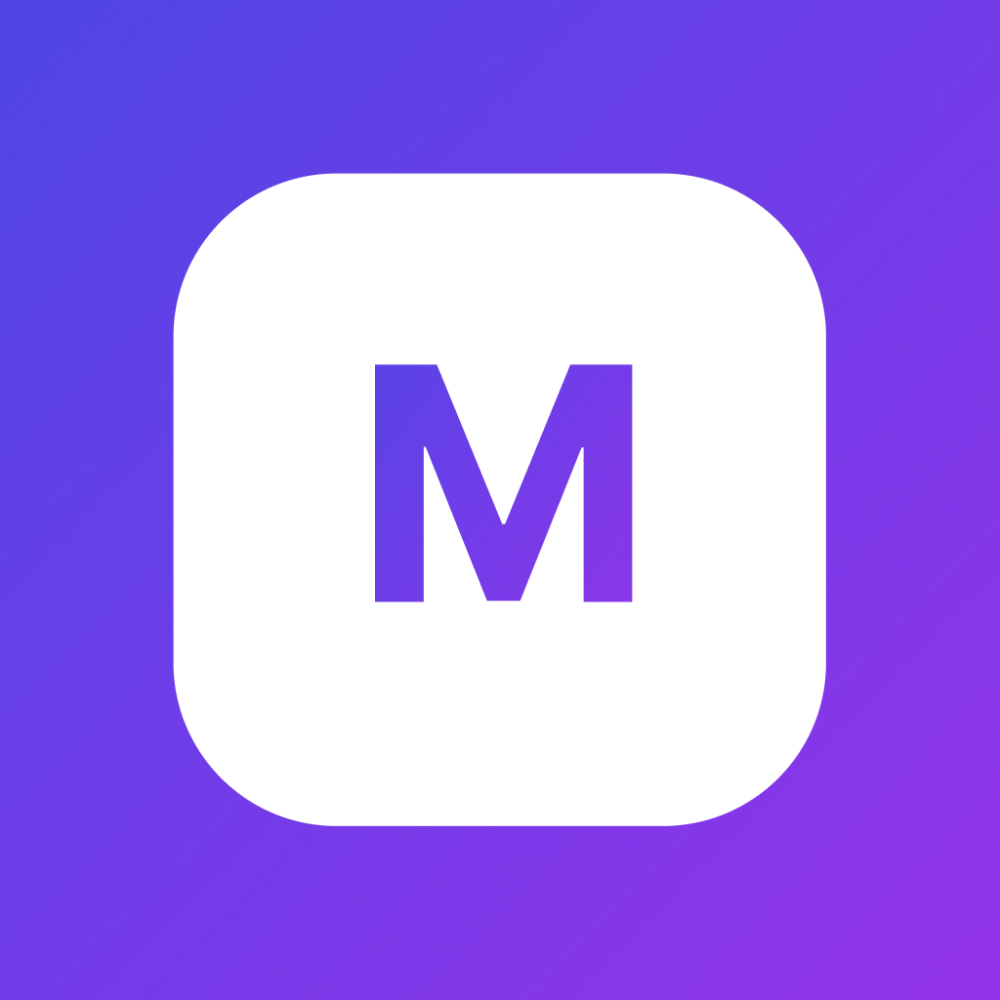

Доступно на 15 языках | [English Version](README.md)

---

## Скриншоты

**iPhone**

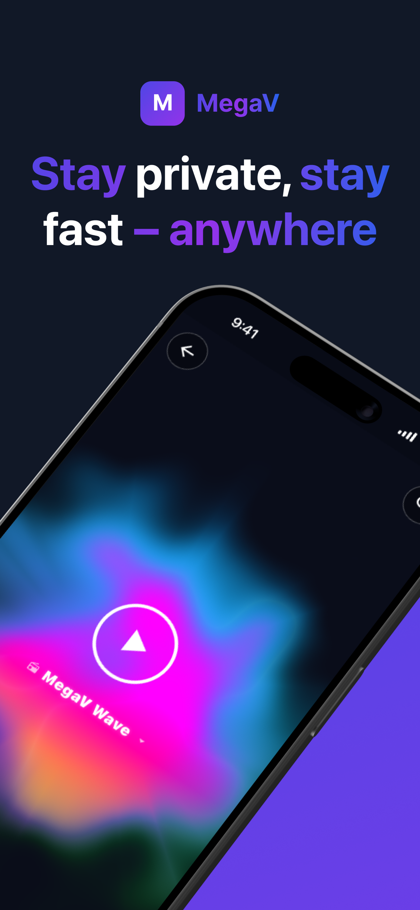
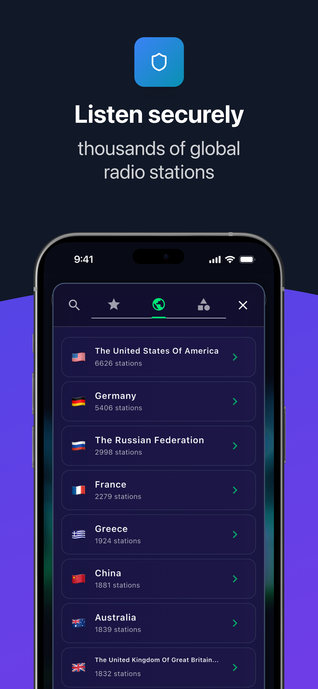
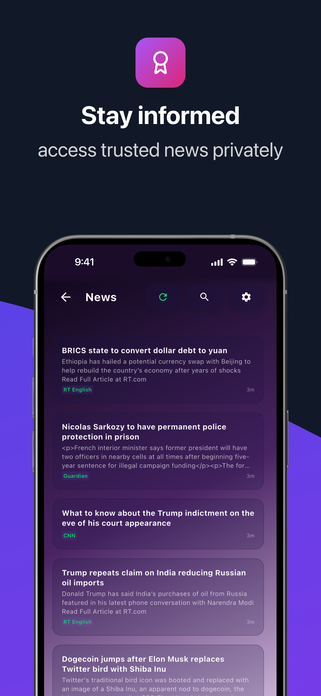
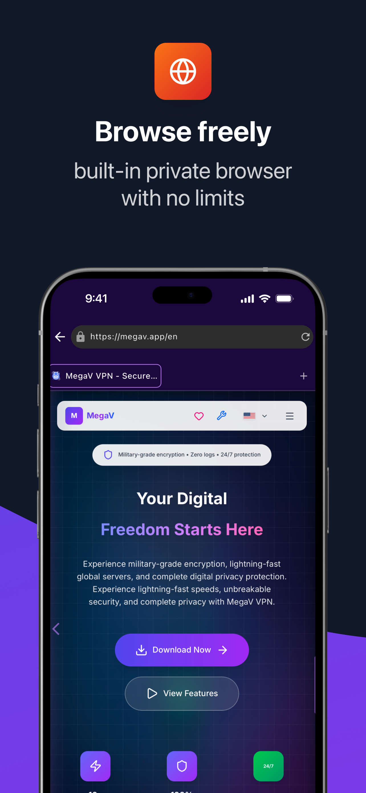
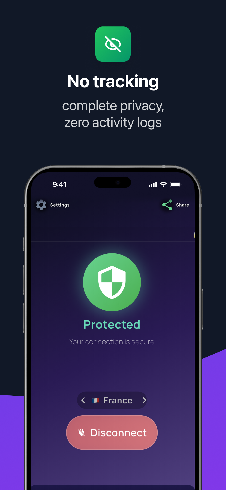
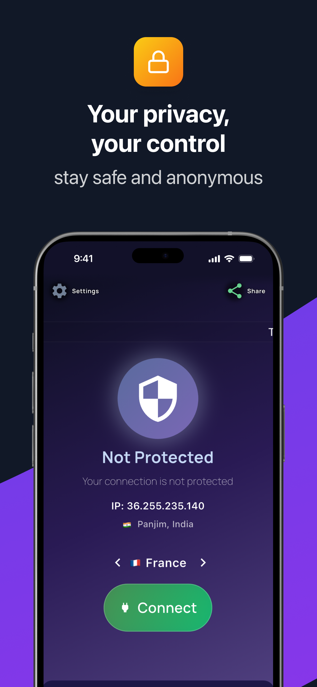

**iPad**

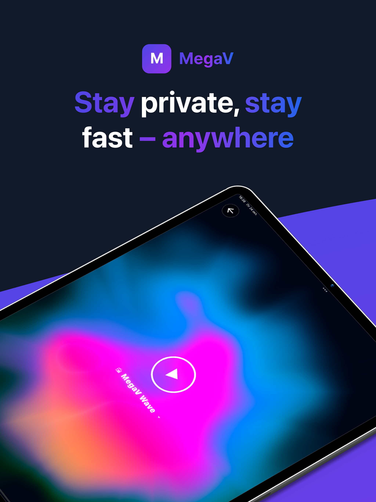
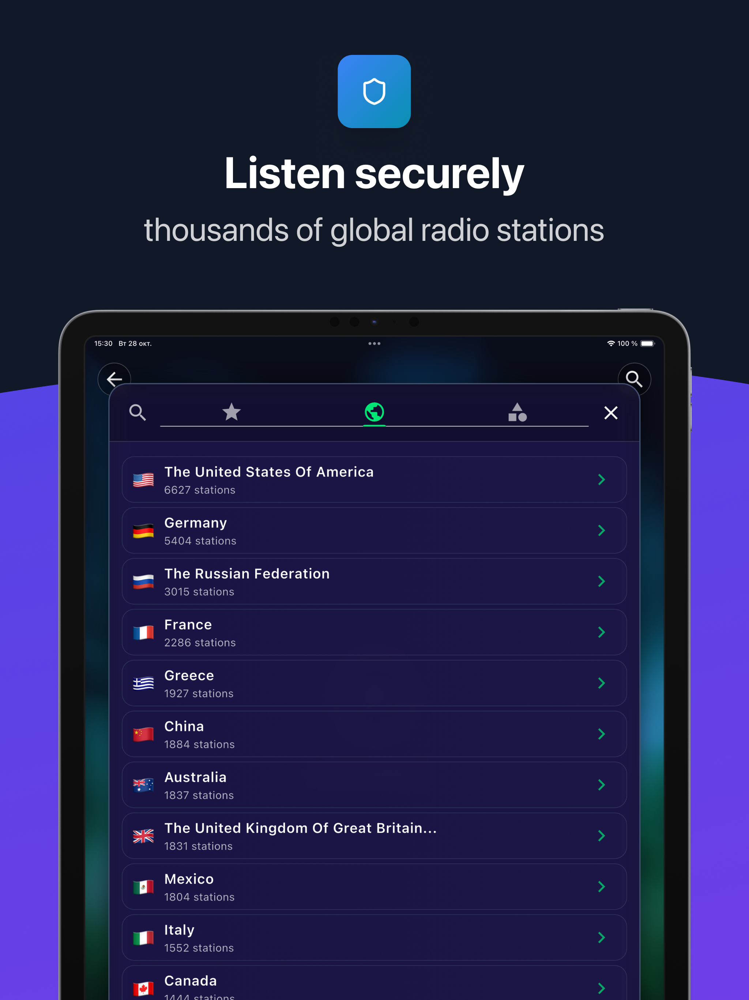
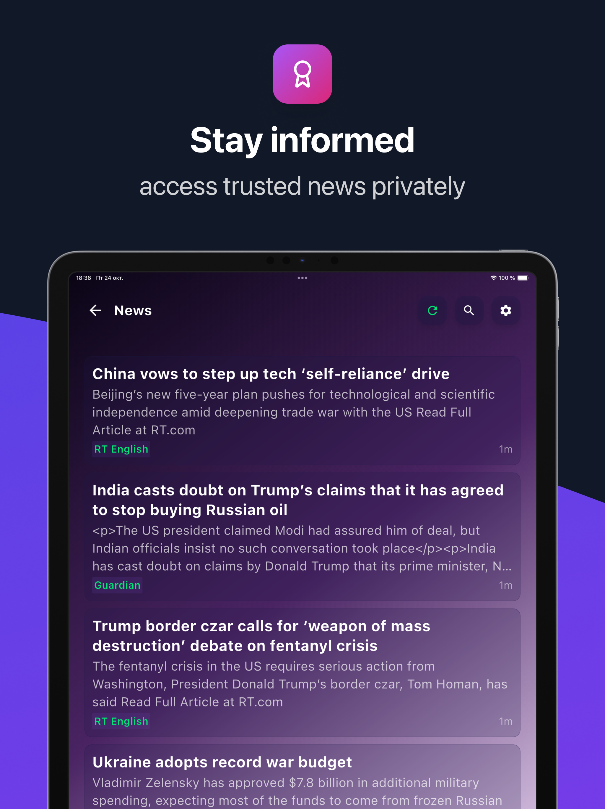
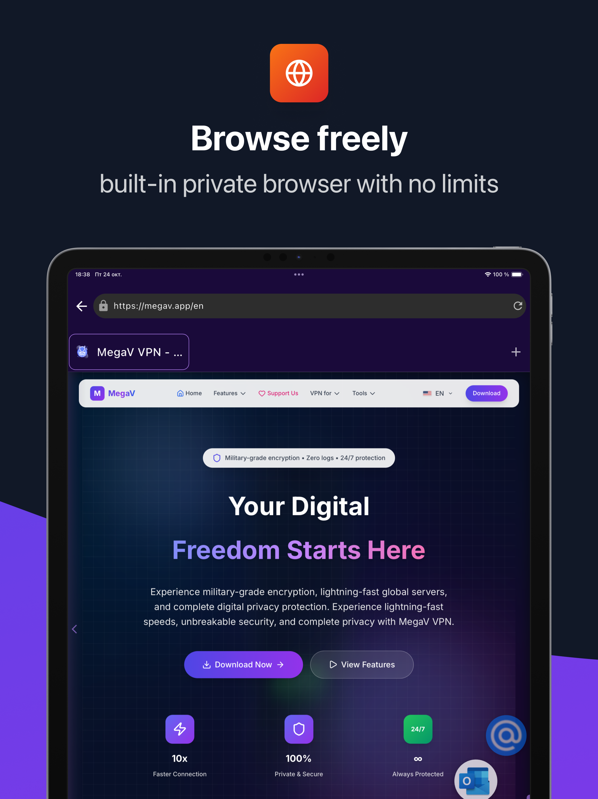
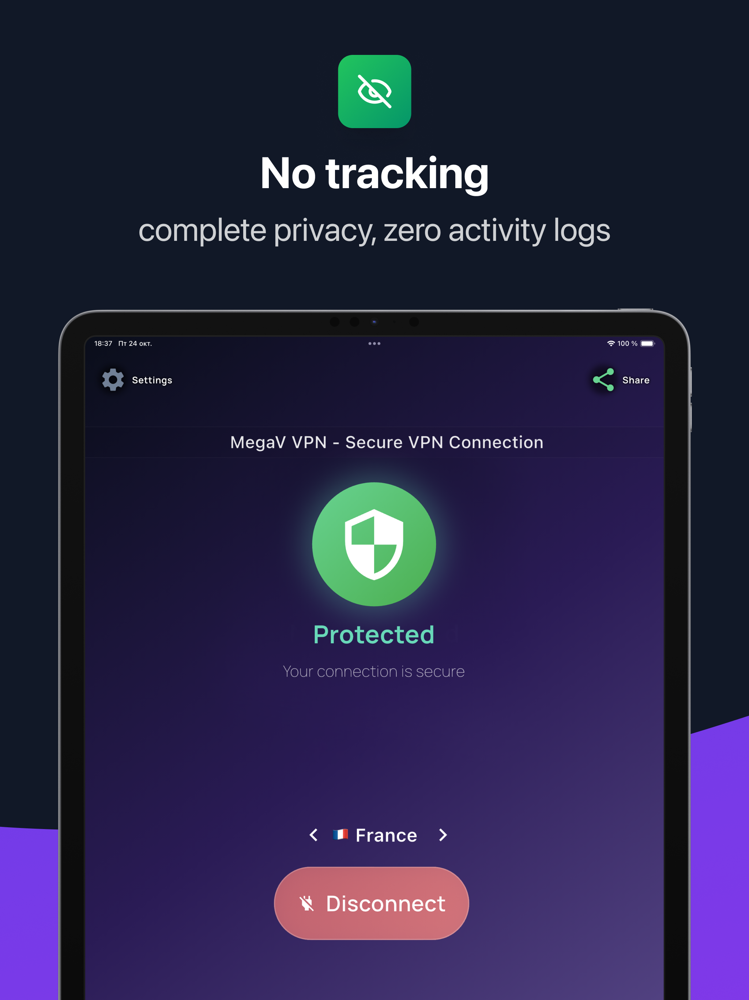
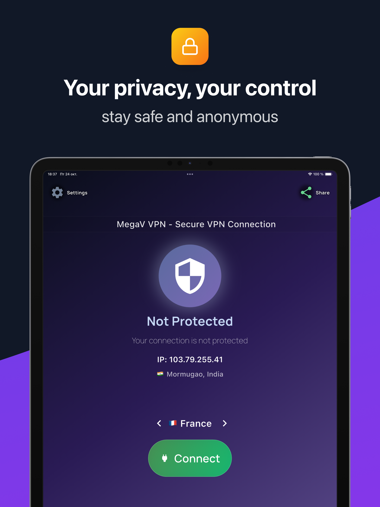

---

## Скачать

| Платформа | Где скачать |
|---|---|
| Android | [Google Play](https://play.google.com/store/apps/details?id=com.megav.secure) / [APK](https://megav.app/#download) |
| iOS | [App Store](https://apps.apple.com/app/id6754278334) |
| macOS | [App Store](https://apps.apple.com/app/id6754278334) |
| Windows | [Скачать](https://megav.app/#download) |

---

## Возможности

- **Сквозное шифрование** — защита данных в любой сети
- **Без логов** — мы не собираем и не храним данные о вашем трафике
- **Мультиплатформенность** — один аккаунт на Android, iOS, macOS и Windows
- **Блокировка рекламы** — встроенная защита от трекеров и рекламы
- **Раздельное туннелирование** — выбирайте, какие приложения используют VPN
- **Kill Switch** — автоматическая защита соединения
- **15 языков** — полная локализация
- **6 тем** — динамическая система тем

---

## Поддерживаемые языки

Арабский, немецкий, английский, испанский, французский, итальянский, японский, корейский, польский, португальский, русский, тайский, украинский, вьетнамский, китайский

---

## Юридическая информация

- [Политика конфиденциальности](privacy-policy.md)
- [Условия использования](terms-of-service.md)
- [GDPR соответствие](gdpr-compliance.md)
- [Лицензия](LICENSE)

---

## Поддержка

- **Email:** support@megav.store
- **Telegram:** [@MegaVSupport](https://t.me/MegaVSupport)
- **Telegram-канал:** [@MegaVPN_Official](https://t.me/MegaVPN_Official)

---

Это публичный репозиторий с документацией, юридическими документами и конфигурацией. Исходный код здесь не публикуется.

*Ваша приватность — наш приоритет*

