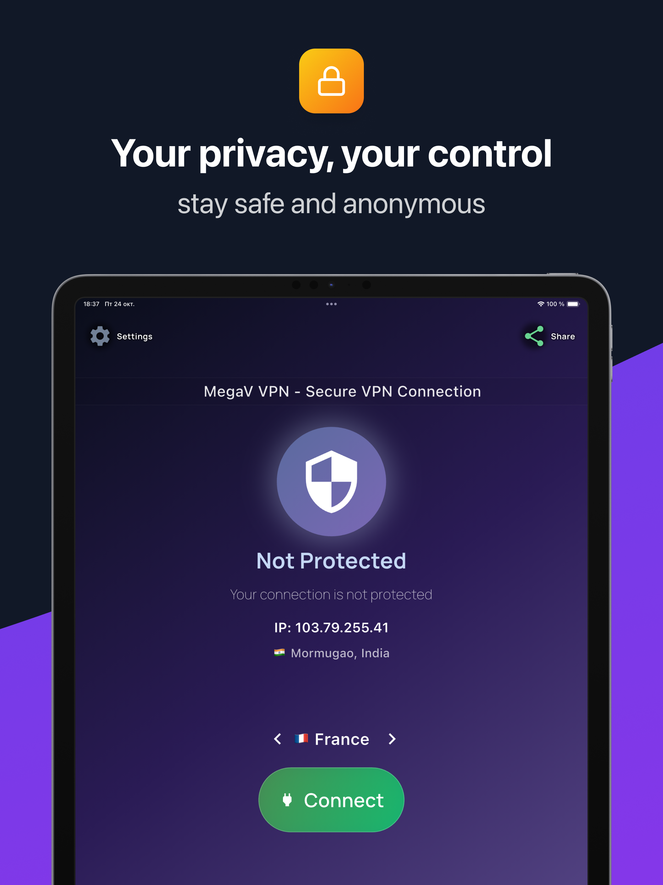
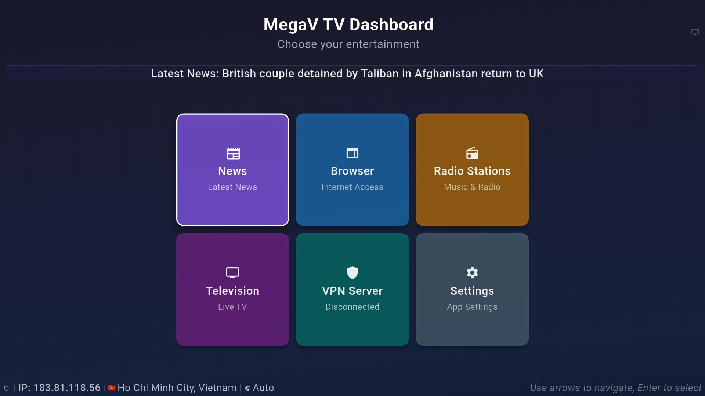

# 🔒 MegaV VPN - Безопасный и Быстрый VPN

**🌍 Доступно на 15 языках**

**[🇺🇸 English Version / Английская версия](README.md)**

---

## 📱 Скриншоты

### Приложение для iPhone

### Приложение для iPad

### ТВ Панель

---

## 🚀 Скачать MegaV VPN Бесплатно

**[📱 Скачать с официального сайта](https://megav.app/ru#download)**

### Официальные Сайты

| Сайт | Описание |
|---|---|
| 🌐 [**megav.app**](https://megav.app) | Главный сайт и загрузки |
| 🛒 [**megav.app/ru**](https://megav.app/ru) | Русская версия |
| 📱 [**megav.app/#download**](https://megav.app/#download) | Прямые загрузки |

### Платформы
- 🤖 **Android** - Google Play Store, APK напрямую
- 🍎 **iOS** - Скоро
- 📺 **Android TV** - Специальная TV версия
- 💻 **Windows, macOS, Linux** - Десктопные версии

---

## 🏆 Почему MegaV VPN - Лучший Выбор 2025

**MegaV VPN** - это **лучший бесплатный VPN 2025 года** с военным шифрованием и безлимитным трафиком. Более **15,847 пользователей** доверяют нашему сервису для безопасного интернета.

### ✨ Ключевые Преимущества

- 🛡️ **Военное шифрование** - AES-256 защита данных
- 🚀 **Сверхбыстрые серверы** - Без ограничений скорости
- 🌍 **Глобальная сеть** - 500+ серверов в 50+ странах
- 📺 **IPTV и Радио** - Доступ к публичному контенту
- 🚫 **Блокировщик рекламы** - Встроенная защита от рекламы
- 🔧 **Раздельное туннелирование** - Выбирайте приложения для VPN
- 📊 **Политика нулевых логов** - Полная конфиденциальность
- 🇪🇺 **GDPR соответствие** - Европейская защита данных
- 💰 **100% Бесплатно** - Без скрытых платежей
- 📱 **Все платформы** - Android, iOS, Windows, macOS, Linux

---

## 📊 Статистика и Рейтинги

| Метрика | Значение |
|---|---|
| ⭐ Рейтинг пользователей | **4.8/5** ⭐⭐⭐⭐⭐ |
| 👥 Активных пользователей | **15,847+** |
| 🌍 Стран с серверами | **50+** |
| 🚀 Средняя скорость | **100+ Mbps** |
| 📱 Поддерживаемых платформ | **6+** |
| 🔒 Время работы | **99.9%** |

---

## 🎯 Для Кого MegaV VPN

- 🎮 **Геймеры** - Снижение пинга и доступ к играм
- 📺 **Любители стриминга** - Разблокировка контента
- 💼 **Бизнес-пользователи** - Безопасная работа
- 🏠 **Домашние пользователи** - Защита семьи
- 🎓 **Студенты** - Доступ к образовательным ресурсам
- 🌐 **Путешественники** - Безопасный интернет в поездках

---

## 🔧 Технические Характеристики

### 🔐 Безопасность
- **Шифрование:** AES-256-GCM
- **Протоколы:** WireGuard, OpenVPN, IKEv2
- **DNS Protection:** Безопасные DNS серверы
- **Kill Switch:** Автоматическая защита соединения
- **Leak Protection:** Защита от утечек IPv6, DNS, WebRTC

### 🌐 Сеть
- **Серверы:** 500+ в 50+ странах
- **Пропускная способность:** Безлимитная
- **Одновременные подключения:** До 5 устройств

---

## 🆚 Сравнение с Конкурентами

| Функция | MegaV VPN | Другие VPN |
|---|---|---|
| 💰 Цена | **Бесплатно** | $5-15/месяц |
| 🚀 Скорость | **100+ Mbps** | 20-50 Mbps |
| 📊 Логи | **Нет логов** | Часто ведут логи |
| 📺 IPTV/Радио | **✅ Включено** | ❌ Отсутствует |
| 🚫 Блокировка рекламы | **✅ Встроена** | ❌ Дополнительно |
| 🔧 Раздельное туннелирование | **✅ Есть** | ❌ Редко |

---

## 🌍 Поддерживаемые Языки

**15 языков с полной локализацией:**

- 🇸🇦 **العربية** (Арабский) - كامل التعريب
- 🇩🇪 **Deutsch** (Немецкий) - Vollständige Lokalisierung
- 🇺🇸 **English** (Английский) - Full localization
- 🇪🇸 **Español** (Испанский) - Localización completa
- 🇫🇷 **Français** (Французский) - Localisation complète
- 🇮🇹 **Italiano** (Итальянский) - Localizzazione completa
- 🇯🇵 **日本語** (Японский) - 完全なローカライゼーション
- 🇰🇷 **한국어** (Корейский) - 완전한 현지화
- 🇵🇱 **Polski** (Польский) - Pełna lokalizacja
- 🇵🇹 **Português** (Португальский) - Localização completa
- 🇷🇺 **Русский** - Полная локализация
- 🇹🇭 **ไทย** (Тайский) - การแปลที่สมบูรณ์
- 🇺🇦 **Українська** (Украинский) - Повна локалізація
- 🇻🇳 **Tiếng Việt** (Вьетнамский) - Bản địa hóa đầy đủ
- 🇨🇳 **中文** (Китайский) - 完整本地化

**Автоматическое определение языка системы**

---

## 📋 Юридическая Информация

### 📄 Документы
- 🔐 [**Политика конфиденциальности**](privacy-policy.md)
- 📜 [**Условия использования**](terms-of-service.md)
- 🇪🇺 [**GDPR соответствие**](gdpr-compliance.md)
- ⚖️ [**Лицензия**](LICENSE)

### 🏢 О Компании
- **Название:** MegaV VPN
- **Основан:** 2023
- **Штаб-квартира:** EU
- **Соответствие:** GDPR, CCPA
- **Аудит безопасности:** Ежегодно

---

## 🔄 Конфигурация и Обновления

### 📡 Серверы
- **Файл конфигурации:** [servers.txt](servers.txt)
- **База данных серверов:** [servers.db](servers.db)
- **Обновления:** Автоматические

### 🔄 Система обновлений
- **Конфигурация:** [update-config.json](update-config.json)
- **Частота:** Ежедневно
- **Безопасность:** Подписанные обновления

---

## 📞 Поддержка и Контакты

### 🆘 Техническая поддержка
- 📧 **Email:** support@megav.store
- 💬 **Telegram:** [@MegaVSupport](https://t.me/MegaVSupport)
- 🌐 **Сайт поддержки:** [help.megav.app](https://help.megav.app)

### 📧 Контакты
- **Общие вопросы:** info@megav.store
- **Юридические вопросы:** legal@megav.store
- **GDPR запросы:** gdpr@megav.store
- **Партнерство:** partners@megav.store

### 🌐 Социальные сети
- 📱 **Telegram:** [@MegaVPN_Official](https://t.me/MegaVPN_Official)
- 🐦 **Twitter:** [@MegaVPN](https://twitter.com/MegaVPN)
- 📘 **Facebook:** [MegaV VPN](https://www.facebook.com/profile.php?id=61581490672784)

---

## 🔍 SEO Ключевые слова

бесплатный vpn, лучший vpn 2025, MegaV VPN, безопасный vpn, быстрый vpn, vpn без логов, vpn для стриминга, защита конфиденциальности, анонимный интернет, vpn сервис, скачать vpn бесплатно, военное шифрование, безлимитный vpn

---

## 🏆 Награды и Признание

- 🥇 **"Лучший бесплатный VPN 2025"** - TechReview
- 🏆 **"Выбор редакции"** - VPNGuide  
- ⭐ **"5 звезд за безопасность"** - SecurityFirst
- 🛡️ **"Лучшая защита конфиденциальности"** - PrivacyWatch

---

## 📈 Статистика GitHub

---

## ⚠️ Важное Уведомление

- 🔒 Это **публичный репозиторий** с документацией и конфигурацией
- 📄 **Исходный код НЕ публикуется** в этом репозитории  
- 🌐 Весь контент предоставлен для прозрачности и соответствия требованиям
- 📧 Для технической поддержки обращайтесь по email

---

## 📅 Последнее обновление

**Январь 2025**

---

**🔒 MegaV VPN - Безопасный и Быстрый VPN**

*Ваша конфиденциальность - наш приоритет*

